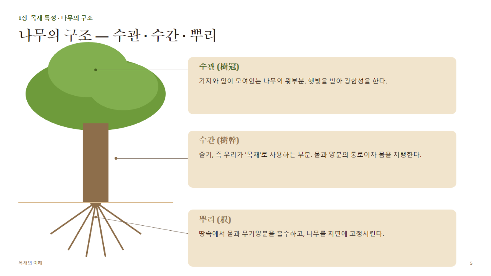
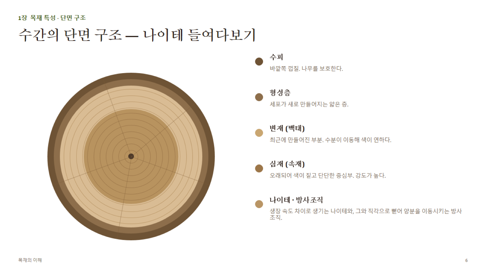

# 1장 · 목재 특성 (상세)

## 1. 생장륜(나이테)과 생장률

- **생장륜**: 형성층이 계절에 따라 다른 속도로 세포를 만들면서 생기는 동심원 무늬.
  - **조재(춘재, earlywood)**: 봄~초여름, 생장 속도 빠름 → 세포벽 얇고 세포 크기 큼 → 밀도 낮음, 색 연함
  - **만재(추재, latewood)**: 여름~가을, 생장 속도 느림 → 세포벽 두껍고 세포 크기 작음 → 밀도 높음, 색 진함
  - **만재율** = 만재 폭 ÷ 나이테 전체 폭 × 100 — 만재율이 높을수록 대체로 밀도·강도가 높다 (특히 침엽수에서 뚜렷)
- **나이테 폭 계산**: 반지름(수피~수심) ÷ 나이테 개수
- **생장 속도와 성질의 관계 (수종별로 다름 — 시험에 자주 나오는 함정)**
  - 침엽수(예: 소나무): 급속생장 → 조재 비율↑ → 밀도·강도 **감소** 경향
  - 환공재 활엽수(예: 참나무): 급속생장 → 만재(치밀한 섬유조직) 비율↑ → 밀도·강도 **증가** 경향
  - 산공재 활엽수: 생장 속도와 밀도의 상관성이 낮음

## 2. 심재와 변재

| 구분 | 변재(Sapwood) | 심재(Heartwood) |
|---|---|---|
| 위치 | 형성층에 가까운 바깥쪽 | 중심부 |
| 기능 | 수분·양분 이동(살아있는 유세포 포함) | 기계적 지지만 담당(세포는 죽어있음) |
| 색 | 연함 | 진함 (추출물 축적) |
| 내구성 | 낮음(부후·충해에 약함) | 높음(추출물의 항균·항충 성분) |
| 방부제 침투성 | 좋음 | 나쁨(치밀화로 침투 어려움) |
| 함수율 | 높음 (침엽수 생재 기준 약 100~200%) | 낮음 (약 30~80%) |

- **심재화(heartwood formation)**: 변재 세포가 죽으면서 타닌, 수지, 페놀류 등 **추출물(extractives)**을 축적하는 과정. 색과 내구성은 높아지지만 **방부제 흡수성은 떨어짐** → 방부처리 시 변재가 유리, 심재는 불리(주의 포인트)

## 3. 밀도와 비중 (심화)

- **기본비중(Basic Specific Gravity, G0)** = 전건 중량 ÷ 생재(포화) 부피 ÷ 물의 밀도
  - 함수율에 따라 부피가 변하므로, 어느 시점의 부피를 기준으로 했는지가 중요 → 학술적으로는 "생재 부피" 기준의 기본비중을 가장 많이 사용
- **함수율별 밀도 보정**: 함수율이 오르면 무게는 늘고(수분 추가) 부피도 늘어나므로(FSP 이하 구간), 실제 밀도는 두 효과가 섞여 나타난다.
- **대표 수종별 기본비중(참고용 근사치 — 산지·개체차 있음)**

| 수종 | 기본비중(대략) | 분류 |
|---|---|---|
| 발사나무(Balsa) | 0.15 | 활엽수(초경량) |
| 삼나무(스기) | 0.35~0.40 | 침엽수 |
| 소나무(적송) | 0.45~0.50 | 침엽수 |
| 잣나무 | 0.40~0.45 | 침엽수 |
| 낙엽송 | 0.50~0.55 | 침엽수 |
| 자작나무 | 0.55~0.65 | 활엽수(산공재) |
| 단풍나무(하드메이플) | 0.55~0.63 | 활엽수(산공재) |
| 느티나무 | 0.60~0.65 | 활엽수(환공재) |
| 참나무(오크류) | 0.60~0.75 | 활엽수(환공재) |
| 흑단(에보니) | 0.95 이상 | 활엽수(초고밀도) |

> 시험 포인트: **비중 1.0 = 물과 같은 밀도**. 목재 세포벽 자체의 실제 비중은 수종과 무관하게 약 **1.5** 로 거의 일정하다 — 수종별 비중 차이는 세포벽 두께와 빈 공간(공극률)의 차이에서 비롯된다.

## 4. 계통 분류

- **나자식물(裸子植物, Gymnosperm)** → 침엽수(Softwood): 씨앗이 씨방 없이 노출, 대부분 상록수, 잎이 바늘형
- **피자식물(被子植物, Angiosperm) 중 쌍떡잎식물** → 활엽수(Hardwood): 씨앗이 씨방 안에 있음, 대부분 낙엽수, 잎이 넓음
- **"소프트우드/하드우드"는 실제 강도가 아니라 식물학적 분류 용어** — 예외: 발사나무(하드우드지만 매우 무름), 주목(소프트우드지만 매우 단단함)

## 5. 세포조직 상세

**침엽수 (조직이 단순 = 균질재)**
- **가도관(헛물관, Tracheid)**: 전체 부피의 약 90~95%. 수분 이동 + 기계적 지지를 동시에 담당하는 길쭉한 세포
- **방사유세포(Ray parenchyma)**: 양분을 가로 방향(방사방향)으로 이동·저장
- **수지구(Resin canal)**: 소나무속 등 일부 침엽수에만 존재하는 수지 저장 통로 — 식별 특징으로 활용

**활엽수 (조직이 복잡 = 역할 분업)**
- **도관(Vessel)**: 굵은 관 형태, 수분 이동 전담. 단면에서 구멍(공)으로 관찰됨
- **섬유(Fiber)**: 두꺼운 세포벽의 좁은 세포, 기계적 지지 전담 — 침엽수 가도관보다 강도 기여도가 높음
- **방사조직(Ray)**: 활엽수는 침엽수보다 방사조직이 발달 → 참나무 등에서 은백색 무늬(메디큘러 레이, medullary ray)로 나타남
- **도관 배열에 따른 3분류**
  - **환공재(Ring-porous)**: 조재에 큰 도관이 띠 모양으로 집중 (참나무, 느티나무, 물푸레나무)
  - **산공재(Diffuse-porous)**: 도관이 단면 전체에 고르게 분포 (자작나무, 단풍나무, 벚나무)
  - **반환공재(Semi ring-porous)**: 중간 형태 (호두나무 일부)
