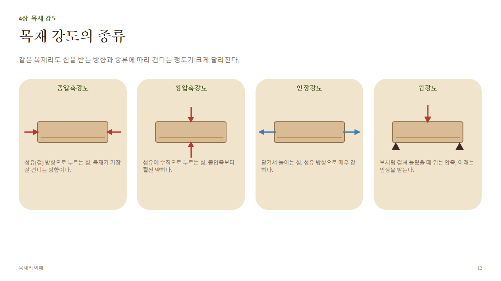

# 4장 · 목재 강도 (상세)

## 1. 강도의 종류와 방향성

목재는 **이방성 재료**(방향에 따라 성질이 다름) — 섬유방향(축방향) / 방사방향 / 접선방향에서 강도가 모두 다르다.

| 강도 종류 | 정의 | 섬유방향 대비 상대 강도(개념) |
|---|---|---|
| **종압축강도** | 섬유 방향으로 누르는 힘 | 기준(가장 잘 견딤 축에 속함) |
| **횡압축강도** | 섬유에 직각으로 누르는 힘 | 종압축의 약 1/4~1/10 수준으로 크게 낮음 |
| **인장강도(섬유방향)** | 섬유 방향으로 당기는 힘 | 목재에서 가장 큰 강도값 — 종압축보다도 큼 |
| **횡인장강도** | 섬유에 직각으로 당기는 힘 | 매우 약함(목재가 갈라지는 방향) |
| **전단강도** | 층이 미끄러지듯 밀리는 힘 | 섬유방향 전단이 특히 약함(보의 파괴 원인 중 하나) |
| **휨강도(MOR)** | 보처럼 걸쳐 눌렀을 때 파괴에 이르는 최대 응력 | 압축·인장·전단이 복합적으로 작용 |

> **왜 인장강도가 압축강도보다 큰가?** 목재 세포벽은 셀룰로오스 미세섬유가 축방향으로 배열된 "천연 복합재"에 가깝다. 인장 시엔 섬유가 그대로 힘을 버티지만, 압축 시엔 가늘고 긴 세포가 옆으로 좌굴(buckling)하며 먼저 무너지기 때문.

## 2. 휨 이론 — MOE와 MOR 구분 (시험 단골 포인트)

- **MOE (Modulus of Elasticity, 탄성계수)**: 하중을 받았을 때 **얼마나 휘는가**(강성, 뻣뻣한 정도)를 나타내는 값. 탄성 범위 내 변형을 다룸 → 처짐 계산, 기계등급(MSR) 표기에 사용
- **MOR (Modulus of Rupture, 파괴계수)**: 부재가 **부러질 때까지의 최대 응력**. 강도 그 자체를 의미
- **관계**: 일반적으로 밀도가 높을수록 MOE·MOR 모두 높아지지만, 두 값은 별개의 물성 — MOE가 높다고 반드시 MOR이 높은 것은 아니다.
- **하중전달과 보의 강성**: 보의 처짐(δ)은 하중(P), 스팬(L)의 세제곱에 비례하고 MOE(E)와 단면 2차모멘트(I)에 반비례 (δ ∝ PL³ / EI) — 스팬이 늘어나면 처짐은 급격히 커진다는 것이 실무적으로 중요(장선·보 스팬표의 근거).

## 3. 강도에 영향을 주는 요인

| 요인 | 영향 |
|---|---|
| **함수율** | 섬유포화점(FSP, 약 28~30%) 이하로 내려갈수록 강도 증가. 대략 함수율 1% 감소당 압축강도 약 4~6% 증가(수종·강도 종류별 차이 있음) |
| **밀도** | 밀도가 높을수록 강도 증가 — 대체로 강도는 밀도의 거듭제곱에 비례하는 경향(선형이 아님) |
| **옹이·결함** | 응력집중으로 인장강도 급감, 압축강도는 상대적으로 영향 적음 |
| **결 기울기(경사결)** | 섬유 방향이 부재 축과 어긋날수록 강도 급감 — 경사 1:10만 되어도 강도가 크게 떨어짐 |
| **하중 지속시간(Duration of Load)** | 오래 지속되는 하중일수록 견디는 힘이 낮아짐(크리프, creep) — 순간 하중 대비 영구 하중 시 허용강도를 낮춰 설계(예: 북미 NDS 기준 하중기간계수 CD 적용) |
| **온도** | 온도가 높아지면 강도 저하, 특히 고온다습 조건에서 크리프가 가속됨 |
| **결의 밀도(만재율)** | 만재율이 높을수록 강도 증가(1장 참고) |

## 4. 압축파괴와 취약성

- **좌굴(Buckling)**: 가늘고 긴 기둥재는 압축력에 대해 재료 강도보다 먼저 **좌굴**로 파괴되는 경우가 많음 → 세장비(길이/단면두께)가 클수록 위험
- **전단파괴**: 보에서 지점 부근 전단력이 커질 때 섬유방향으로 쪼개지듯 파괴 — 목재 보 설계에서 전단이 종종 지배적 파괴모드가 됨
- **취성 vs 연성**: 목재는 인장 시 비교적 취성적(급작스런 파괴)이고, 압축 시엔 세포 좌굴로 점진적 파괴(연성적 거동에 가까움) — 이 때문에 구조설계에서는 압축부재보다 인장부재 파괴가 더 위험하게 다뤄짐

## 5. 구조 등급(Grading)

| 등급 방식 | 방법 | 특징 |
|---|---|---|
| **육안등급(Visual Grading)** | 옹이 크기, 결 기울기, 갈라짐 등을 육안으로 검사해 규정된 허용치와 비교 | 저비용, 숙련 검사원 필요 |
| **기계등급(MSR, Machine Stress Rated)** | 기계로 부재를 휘어 탄성계수(E)를 실측 | 표기 예: **"1650Fb-1.5E"** → 허용휨응력 1650psi, 탄성계수 1.5×10⁶psi |

- **육안등급 예시 체계(북미 구조재 기준, 개념 참고용)**: **Select Structural(SS) > No.1 > No.2 > No.3** 순으로 결함 허용치가 엄격 → 등급이 높을수록 옹이가 작고 결 기울기가 완만해야 함
- **등급별 용도**: SS·No.1은 큰 하중을 받는 보·기둥, No.2는 일반 장선·스터드, No.3·유틸리티는 비구조 용도(블로킹 등)에 주로 사용
- **실무 연결**: 건축목공에서 부재를 고를 때 **등급 도장(stamp)**에 표기된 수종그룹, 등급, 함수율(S-DRY/KD 등), 등급기관 마크를 확인하는 것이 기본
