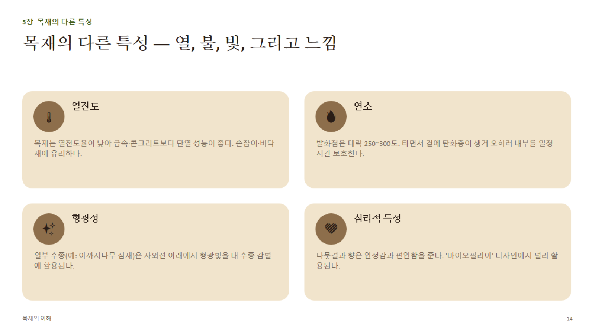

# 5장 · 목재의 다른 특성 (상세)

## 1. 열전도 (Thermal Conductivity)

- 목재는 세포 내 공기층(빈 공간)이 많아 열전도율이 낮음 → **천연 단열재**
- **상대 비교(대략치, W/m·K)**: 목재 약 **0.1~0.2** ↔ 콘크리트 약 1.4~1.7 ↔ 유리 약 1.0 ↔ 강철 약 **45~50**
- 밀도가 높을수록, 함수율이 높을수록 열전도율도 **증가**(공극이 줄고 수분이 열을 더 잘 전달하기 때문)
- 실무 적용: 손잡이·바닥재·사우나 내장재에 목재가 선호되는 이유(촉감이 차갑지 않음)

## 2. 목재 연소

- **착화점(발화점)**: 대략 **250~300°C** 부근에서 열분해·가스 발생 후 착화
- **탄화(Charring)**: 목재가 타면서 표면에 검은 탄화층이 형성됨. 이 탄화층은 열전도율이 더욱 낮아 **내부를 일정 시간 보호**하는 역할(단열 효과)
- **탄화 속도(대략치)**: 약 **0.6~0.8mm/분** — 구조설계에서 대형 목부재(집성재 등)는 이 속도를 근거로 "필요 단면 + 탄화 여유분"을 더해 내화 성능을 확보하기도 함(중목구조·대형목구조의 내화설계 개념)
- **금속과의 차이**: 강철은 화재 시 갑자기 강도를 잃고 좌굴되는 반면, 목재(특히 큰 단면)는 표면부터 서서히 타 들어가므로 **예측 가능한 내화 거동**을 보인다는 점이 대형목구조의 장점으로 꼽힘

## 3. 형광성(Fluorescence)

- 일부 수종의 추출물이 자외선(UV)에 반응해 형광빛을 냄 — 대표적으로 **아까시나무(로블리니아) 심재** 등이 알려짐
- 감별(수종 식별) 보조 수단으로 활용

## 4. 심리적 특성

- 나뭇결의 규칙적이면서도 불규칙한 프랙탈 패턴, 은은한 향(테르펜류 등 휘발성 물질)이 심리적 안정감을 유발한다는 연구들이 존재
- **바이오필리아(Biophilia) 디자인**: 자연 요소(목재 포함)를 실내에 도입해 스트레스를 낮추고 집중력·쾌적감을 높이는 설계 접근 — 병원·학교·사무공간 마감재로 목재 활용이 늘어나는 배경

## 5. 기타 참고 특성

- **전기 절연성**: 건조 목재(함수율 낮음)는 절연체에 가깝지만, 함수율이 높아질수록 전기저항이 급격히 낮아짐 → **전기저항식 함수율계의 측정 원리**가 바로 이것 (함수율↔전기저항의 역상관관계)
- **음향 특성**: 가문비나무 등 일부 수종은 진동 전달·공명 특성이 뛰어나 악기(바이올린 상판 등) 재료로 쓰임
