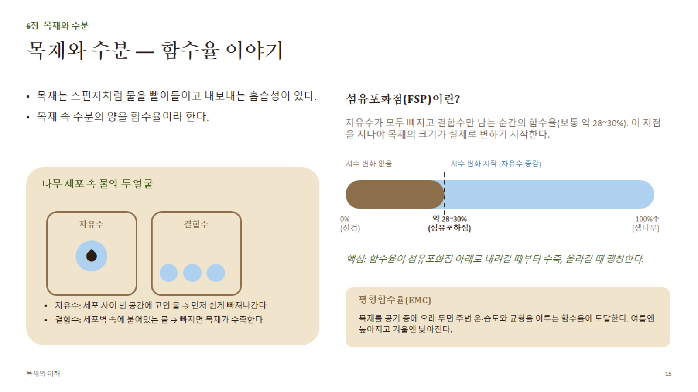

# 6장 · 목재와 수분 (상세)

## 1. 함수율(MC, Moisture Content)의 정의

**함수율(%) = (습윤중량 − 전건중량) ÷ 전건중량 × 100**

- 분모가 "습윤중량"이 아니라 **"전건중량"**이라는 점이 핵심 — 그래서 생재의 함수율은 100%를 훌쩍 넘기도 한다(침엽수 변재는 200% 이상인 경우도 있음).
- 측정법: ① 전건법(고온 건조 전후 무게 비교, 가장 정확) ② 전기저항식 함수율계(저항 측정, 5~30% 구간에서 신뢰도 높음) ③ 정전용량식 함수율계(비접촉, 표층 측정)

## 2. 자유수와 결합수

| 구분 | 존재 위치 | 특징 |
|---|---|---|
| **자유수(Free water)** | 세포 내강(빈 공간) | 모세관 현상으로 존재, 빠지기 쉬움, **빠져도 치수 변화 없음**, 목재 강도에 거의 영향 없음 |
| **결합수(Bound water)** | 세포벽 내부(셀룰로오스·헤미셀룰로오스와 수소결합) | 빠지기 어려움, **빠지면 세포벽이 수축**(치수 변화의 원인), 함수율이 낮아질수록 강도 증가 |

## 3. 섬유포화점(FSP, Fiber Saturation Point)

- 자유수가 모두 빠지고 결합수만 남은 상태의 함수율 — 대표적으로 **약 28~30%** (수종에 따라 22~35% 범위로 다소 차이)
- **FSP를 기준으로 목재의 거동이 완전히 달라짐**
  - FSP 이상: 함수율이 변해도 치수·강도 변화 없음(자유수만 증감)
  - FSP 이하: 함수율이 변하면 치수가 변하고(수축/팽윤), 강도도 변함(함수율↓ → 강도↑)

## 4. 평형함수율(EMC, Equilibrium Moisture Content)

- 목재를 일정한 온도·습도 환경에 오래 두면 도달하는 평형 상태의 함수율. 상대습도(RH)와 온도에 의해 결정됨 (EMC 표/선도로 산정)
- **대략적인 국내(온대) 계절별 EMC 참고치**
  - 여름(고온다습): 약 **16~18%**
  - 겨울(저온건조, 난방 실내): 약 **8~10%**
  - 실내(냉난방 상시): 연중 약 **10~12%** 근처로 완만하게 변동
- **실무 시사점**: 가구·창호는 **사용될 환경의 EMC에 맞춰 미리 건조**해야 설치 후 변형이 없다 — 실내 난방 환경이면 함수율을 10~12% 선까지 낮춰 제작하는 것이 일반적

## 5. 생재 · 기건재 · 인공건조재

| 구분 | 함수율(대략) | 설명 |
|---|---|---|
| 생재(Green wood) | FSP 이상 (100%↑ 가능) | 벌목 직후 상태 |
| 기건재(Air-dried) | 대략 **12~18%** | 자연 대기 중 건조, 그 지역의 연평균 EMC 수준까지 도달 |
| 인공건조재(Kiln-dried, KD) | 대략 **6~12%** (용도별 목표치 설정) | 건조실에서 온·습도를 제어해 목표 함수율까지 강제 건조 |

## 6. 목재 치수변화 개요 (7장과 연결)

- 결합수 증감 → 세포벽 수축·팽윤 → 목재 전체의 치수 변화로 이어짐
- 변화량은 **방향에 따라 다름**(길이 ≪ 방사 < 접선) — 자세한 수치는 7장 참고

## 7. 불균일 수축과 팽윤

- 심재/변재, 만재/조재, 정상재/이상재 등 조직이 다른 부분끼리 **수축률 차이**가 나면서 목재 내부에 **건조응력**이 발생
- 결과: 표면균열, 내부균열, 뒤틀림(비틀림·활모양·다이아몬드형 등)으로 나타남 — 8장 "건조 결함"과 직결되는 원인
