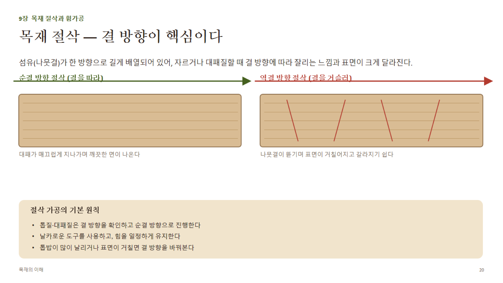
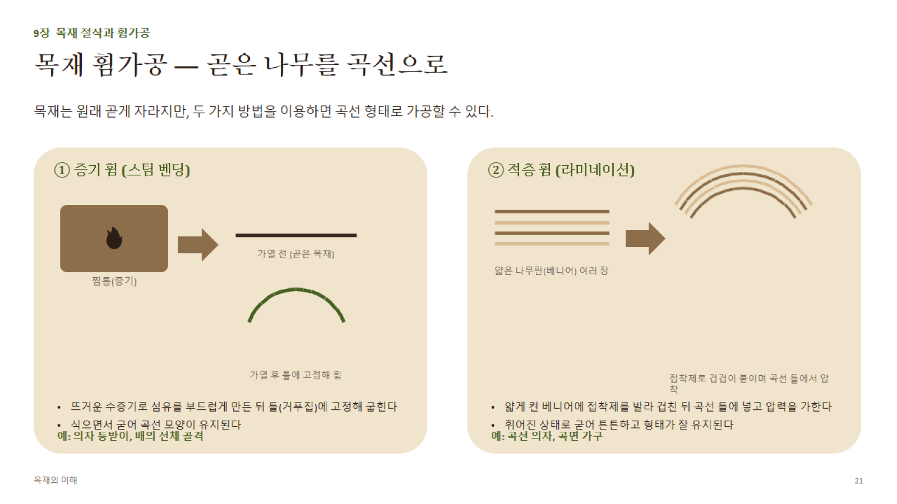

# 9장 · 목재 절삭과 휨가공 (상세)

## 1. 목재 절삭의 기본 원리

- **순결 방향(with the grain)**: 도구날이 섬유가 뻗은 방향을 따라 진행 → 섬유가 매끄럽게 잘려나감
- **역결 방향(against the grain)**: 도구날이 섬유를 거슬러 진행 → 섬유가 들뜨며 뜯겨 거친 면·잔가시가 생김
- **결 방향 판별법**: 목재 옆면(정목/판목 단면)을 보면 섬유가 비스듬히 기운 방향을 알 수 있음 — 손으로 표면을 쓸어보아 매끄러운 방향이 순결

## 2. 절삭각과 날 각도 (대패·평삭기 기준 개념)

- **날 각도(bevel angle)**: 날이 갈린 예각
- **여유각(clearance angle)**: 날 아래면과 목재 표면 사이의 각 — 마찰 방지
- **절삭각(cutting angle) = 날 각도 + 여유각 관계로 결정**: 절삭각이 작을수록 날카롭게 파고들어 순결 방향에서 매끄럽지만, 역결·옹이 부위에서는 오히려 뜯김이 심해질 수 있음 → 옹이가 많은 목재는 절삭각을 다소 크게(무딘 각) 설정하는 것이 안전한 경우도 있음
- **함수율과 절삭성**: 함수율이 너무 낮으면(과건조) 부스러지듯 잘리고, 너무 높으면 섬유가 눌리며 매끄럽게 잘리지 않음 — 일반적으로 **함수율 8~15%** 구간에서 절삭성이 가장 양호

## 3. 절삭 가공의 기본 원칙

1. 결 방향을 먼저 확인하고 순결 방향으로 가공
2. 날은 항상 날카롭게 유지 — 무딘 날은 마찰열로 표면을 태우거나 눌러 광택 얼룩(burnishing)을 남김
3. 이송 속도·압력을 일정하게 유지해 절삭 두께 편차 최소화
4. 옹이·이상재 부근은 역결이 되기 쉬우므로 방향 전환 또는 얕은 절삭으로 대응
5. 톱밥 형태로도 상태 진단 가능: 고운 가루 형태면 날이 무디거나 과건조, 긴 리본 형태면 정상

## 4. 원목 휨가공(Bending)

### (1) 증기 휨(Steam Bending)

- **원리**: 고온·고습 수증기가 목재 속 리그닌(세포를 붙이는 접착 성분 역할)을 일시적으로 연화 → 소성변형이 가능해진 상태에서 틀에 고정해 굽힌 뒤 냉각·건조하며 형태 고정
- **처리 조건(대략)**: 찜통 내부 온도 약 **100°C 내외**(상압 스팀), 시간은 두께 25mm 기준 약 1시간 내외가 일반적 기준으로 언급됨(수종·두께에 따라 조정)
- **곡률 반지름 제한**: 경험적으로 **곡률반지름 ≥ 부재 두께 × 약 8~10배** 정도가 무리 없는 범위로 통용(수종·처리조건에 따라 달라짐) — 너무 급한 곡률은 표면 인장측 섬유 파단 위험
- **인장측 보강**: 급한 곡률에서는 바깥쪽(인장측)에 금속 스트랩을 덧대 섬유가 늘어나며 끊어지는 것을 방지하는 기법도 사용됨
- **적합 수종**: 산공재이면서 방사조직이 과하지 않은 수종(참나무, 물푸레나무, 너도밤나무 등)이 전통적으로 널리 쓰임

### (2) 적층 휨(Laminated Bending)

- **원리**: 얇게 켠 베니어(단판)를 접착제로 겹겹이 붙인 뒤, 곡선 틀(clamping form/caul)에 넣고 압력을 가해 경화시키는 방식
- **베니어 두께와 곡률의 관계**: 얇을수록 급한 곡률도 가능 — 대략 **곡률반지름이 베니어 두께의 약 100배 이상**이면 무리 없이 휘어짐(경험적 기준, 실제로는 접착제·수종에 따라 달라짐)
- **스프링백(Springback)**: 압력을 풀면 목재가 원래 형태로 약간 되돌아가려는 현상 — 이를 고려해 설계 곡률보다 살짝 더 급하게(overbend) 제작하는 보정이 필요
- **증기휨 대비 장점**: 형태 유지력이 뛰어나고 복잡한 곡선(S자 등)도 가능, 강도도 우수(접착층이 오히려 강성을 보강) / **단점**: 적층선이 보여 순수 원목 질감은 떨어질 수 있음

## 5. 두 휨가공 방식 비교

| 구분 | 증기휨 | 적층휨 |
|---|---|---|
| 재료 | 원목 각재(통재) | 얇은 베니어 여러 장 |
| 형태 유지력 | 스프링백 있음, 시간 지나 약간 풀릴 수 있음 | 접착제가 형태를 고정, 유지력 우수 |
| 질감 | 원목 그대로(이음선 없음) | 적층선이 보일 수 있음 |
| 대표 용도 | 의자 등받이, 선체 골격, 후프류 | 곡선 의자 좌판·등받이, 곡면 가구, 캔틸레버 구조 |
