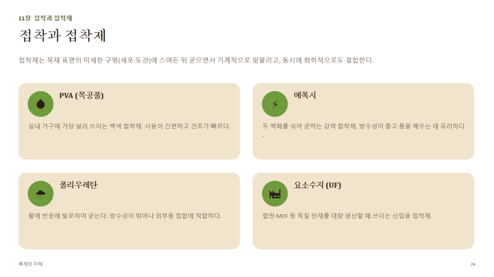

# 11장 · 접착과 접착제 (상세)

## 1. 접착의 원리

- **기계적 맞물림(Mechanical interlocking)**: 액체 상태의 접착제가 목재 표면의 미세한 구멍(도관, 세포내강, 거칠기)에 스며든 뒤 굳으면서 "닻(anchor)"처럼 물리적으로 맞물림
- **화학적 결합(Chemical bonding)**: 접착제 분자와 목재 성분(셀룰로오스 등)의 극성기 사이에 수소결합·반데르발스 힘 등이 작용
- **접착 강도에 영향을 주는 요인**: 목재 표면 상태(대패면이 사포면보다 접착에 유리한 경우多), 함수율(접착 시 목표 함수율 대략 **8~14%** 권장 — 너무 습하면 경화 방해, 너무 건조하면 접착제가 급속 흡수되어 표면 경화 불량), 압착 압력·시간, 접착제와 목재의 산도(pH) 궁합

## 2. 접착제별 특성 비교

| 접착제 | 주성분 | 개방시간 | 내수성 | 특징·용도 |
|---|---|---|---|---|
| **PVA (목공풀)** | 폴리비닐아세테이트 에멀전 | 짧음(5~10분) | 낮음~중간(내수형도 있음) | 실내 가구 표준, 사용 간편, 투명 경화 |
| **에폭시(Epoxy)** | 2액형(수지+경화제) | 김(제품별 다양) | 매우 높음 | 강력 접착, 틈 메움(gap-filling) 우수, 이종재료 접합 가능 |
| **폴리우레탄(PU)** | 이소시아네이트계, 수분 반응형 | 중간~긺 | 매우 높음(방수) | 경화 중 발포(팽창) → 클램핑 필수, 외부용 |
| **요소수지(UF, Urea-Formaldehyde)** | 요소+포름알데히드 축합수지 | 제품별 상이 | 낮음(실내용) | 합판·파티클보드·MDF 등 대량생산 공정용, 경제적 |
| **페놀수지(PF, Phenol-Formaldehyde)** | 페놀+포름알데히드 | 김 | 매우 높음(내수 1급) | 구조용 합판·OSB 등 외부/구조용 판재에 사용 |
| **멜라민수지(MUF)** | 멜라민 강화 요소수지 | 중간 | 높음 | UF보다 내수성 강화, 집성재·준구조용 |
| **핫멜트(Hot melt)** | 열가소성 수지 | 매우 짧음(수십 초) | 제품별 상이 | 엣지밴딩 등 신속 가접착용 |

## 3. 접착 공정의 핵심 변수

1. **도포량**: 너무 적으면 starved joint(굶주린 접착층, 접착 부족), 너무 많으면 글루라인이 두꺼워져 오히려 강도 저하
2. **개방시간(Open time)**: 접착제를 바른 후 압착 전까지 허용 시간 — 초과 시 표면 경화로 접착 불량
3. **압착 시간·압력**: 제품별 지정 압력(보통 0.5~1.5MPa 내외)을 균일하게 유지
4. **경화 온도**: 저온(특히 5°C 이하)에서는 PVA 등 수계 접착제의 경화가 급격히 나빠짐 — 작업장 온도 관리 필요
5. **글루라인 두께**: 얇고 균일한 접착층이 가장 강함 — 압착 압력 부족 시 두꺼워짐

## 4. 접착접합 vs 기계접합(비교 관점)

- 접착접합은 **면 전체에 하중을 분산**시켜 이론상 기계접합보다 효율적인 응력 분포를 만들 수 있음
- 다만 접착접합은 **품질관리(표면처리·함수율·압착)에 매우 민감** — 현장 시공보다는 공장/작업실 통제된 환경에 적합
- 실무에서는 접착 + 기계체결(목심, 비스킷, 나사)을 **병용**해 접착 경화 전 위치 고정과 최종 강도를 동시에 확보하는 경우가 많음
