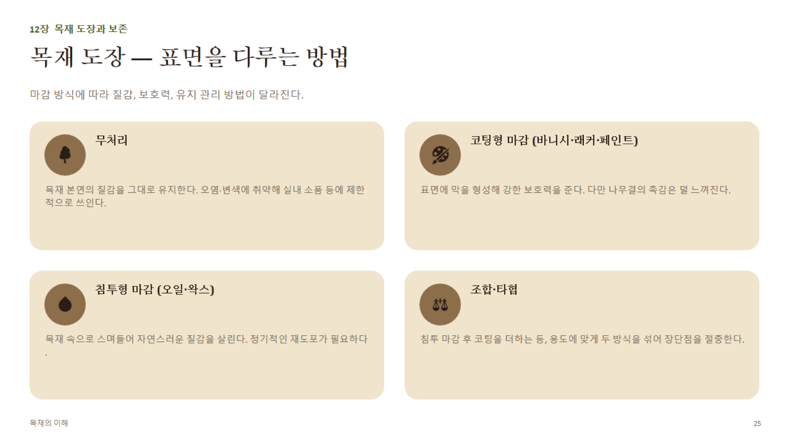

# 12장 · 목재 도장과 보존 (상세)

## 1. 표면상태 준비 (도장 전 필수 공정)

1. **함수율 확인**: 도장 전 목표 함수율 대략 **10~14%** (지역·용도별 EMC에 맞춤) — 함수율이 높으면 도막 들뜸·백화 위험
2. **샌딩(sanding)**: 결 방향을 따라 단계적으로 고운 사포로(예: #120 → #180 → #220) 표면 정리 — 역결 사포질은 스크래치를 남김
3. **샌딩실러(sanding sealer)**: 도장 첫 단계에서 모공(도관)을 메우고 다음 도막 흡수를 균일하게 만듦(특히 환공재처럼 도관이 큰 목재에서 중요)

## 2. 마감 방식 4분류

| 방식 | 원리 | 장점 | 단점 |
|---|---|---|---|
| **무처리** | 표면 그대로 | 가장 자연스러운 질감 | 오염·변색·수분에 매우 취약 |
| **코팅형(바니시·래커·페인트·폴리우레탄 도료)** | 표면에 연속 도막 형성 | 내마모·내수성 우수, 강한 보호 | 나무결 촉감 감소, 재도장 시 전체 벗겨내야 함 |
| **침투형(오일·왁스)** | 목재 내부로 스며들어 발수·강화 | 촉감이 자연스러움, 부분 재도포 용이 | 보호력이 코팅형보다 약함, 정기 관리 필요(연 1~2회) |
| **조합(오일+왁스, 오일+코팅)** | 침투 후 표면 보호층 추가 | 질감과 보호력 절충 | 공정 단계 증가 |

## 3. 도장 공정 순서(일반적인 코팅형 마감 기준)

1. 표면 준비(샌딩) → 2. 샌딩실러(모공 메움) → 3. 사포 재작업(#220 내외) → 4. **중도(under coat)** → 5. 사포 재작업 → 6. **상도(top coat)** — 광택 정도(무광/저광/유광)는 상도에서 결정

## 4. 표면상태별 특수 처리

- **무처리 유지 시 관리**: 정기 청소, 직사광선 회피(변색 방지)
- **침투 마감 재도포 지연 관리**: 왁스층이 남아있는 상태에서 오일을 덧바르면 흡수 불량 → 재도포 전 가벼운 샌딩 또는 왁스 제거 필요
- **도료면의 평가**: 부착력(테이프 박리시험), 경도(연필 경도시험), 내후성(UV 변색·백화 여부)으로 점검

## 5. 목재 보존처리 (야외·구조용 목재)

| 처리 | 목적 | 방법 |
|---|---|---|
| **방부처리** | 부패균·곤충 침입 방지 | 가압주입(pressure treatment) 또는 표면 도포. 방부제가 세포 깊숙이 침투해야 효과적 — **변재가 심재보다 침투가 잘 됨**(1장 참고) |
| **방염처리** | 화재 확산 지연 | 표면 도포형 또는 침윤형 방염제 |
| **UV 차단 마감** | 목재의 은회색 풍화(그레잉) 지연 | UV 흡수제 함유 오일/도료 |
| **방수처리** | 수분 흡수 차단 | 발수제, 오일 마감 |

- **가압방부처리 등급 개념**: 사용 환경(지면 접촉 여부, 상시 침수 여부 등)에 따라 방부제 주입량 기준이 달라짐 — 데크재(지면 근접)는 구조재보다 높은 등급 요구
- **보존처리의 한계**: 어떤 처리도 목재의 수명을 "영구적으로" 보장하지 않음 → **정기 점검 + 필요시 재처리**가 실질적인 장기 대책
