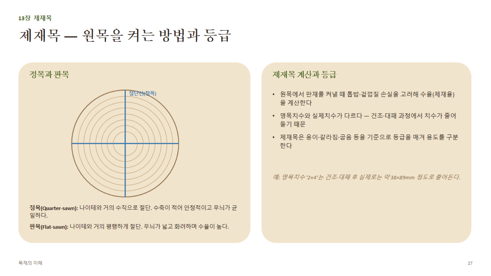

# 13장 · 제재목 (상세)

## 1. 제재 방식 — 정목과 판목

원목을 어느 각도로 켜느냐에 따라 판재의 성질이 크게 달라진다.

| 구분 | 정목(Quarter-sawn) | 판목(Flat-sawn, 나뭇결 제재) |
|---|---|---|
| 절단 각도 | 나이테와 거의 **수직(직각)**에 가깝게 | 나이테와 거의 **평행**하게 |
| 무늬 | 일정하고 좁은 직선 무늬(참나무는 은백색 메디큘러 레이 무늬) | 넓고 화려한 나이테 산(山) 무늬 |
| 치수 안정성 | 높음(접선방향 수축이 판재의 "두께" 방향으로만 작용) | 낮음(접선방향 수축이 판재의 "폭" 방향에 작용 → 컵핑 발생 쉬움) |
| 수율(원목당 생산량) | 낮음(절단 방법이 까다롭고 손실 많음) | 높음 |
| 가격 | 높음 | 상대적으로 낮음 |
| 용도 | 고급 가구, 마루판(안정성 중시) | 일반 구조재, 보편적 가구재 |

- **반정목(Rift-sawn)**: 정목과 판목의 중간 각도(약 30~60도)로 켜는 방식 — 무늬가 일정하면서 수율은 정목보다 나음

## 2. 제재목 계산 — 수율(제재율)

**제재율(%) = 실제 사용 가능한 목재 부피 ÷ 원목 부피 × 100**

- 손실 요인: 겉껍질(수피), 변재 중 결함부, 톱날 두께만큼의 손실(톱밥, kerf loss), 옹이·갈라짐 제거
- 원목 지름이 클수록, 곧을수록 수율이 높아지는 경향

## 3. 명목치수 vs 실제치수 (매우 자주 나오는 실무 포인트)

- **명목치수(Nominal size)**: 제재 직후, 건조·대패 가공 전의 호칭 치수 (예: "2×4")
- **실제치수(Actual/Dressed size)**: 건조로 인한 수축 + 대패(surfacing) 가공으로 깎여나간 만큼 줄어든 최종 치수
- **대표 환산 예(북미 규격재 기준, 참고용)**

| 명목치수 | 실제치수(대략) |
|---|---|
| 1× (예: 1×4) | 약 19mm(3/4") 두께 |
| 2×4 | 약 38×89mm (1½"×3½") |
| 2×6 | 약 38×140mm (1½"×5½") |
| 2×8 | 약 38×184mm (1½"×7¼") |

> **왜 이렇게 줄어드나**: 제재 직후 생재 상태의 명목치수 목재를 건조(수축)시키고, 표면을 대패로 매끄럽게 가공(surfacing, 보통 각 면당 약 1.5~3mm 절삭)하기 때문에 최종 실제치수는 명목치수보다 작다.

## 4. 제재목 분류와 등급

- **용도별 분류**: 구조용재(Structural lumber) / 마감재(Finish lumber, 몰딩·트림) / 가구용재
- **등급 기준(육안등급 공통 항목)**: 옹이 크기·개수, 갈라짐·할렬(split/check) 정도, 결 기울기(경사결), 뒤틀림(bow·crook·twist·cup), 변색·부후 여부
- **등급이 높을수록**: 결함 허용치가 엄격, 가격이 높고, 구조재로서 신뢰할 수 있는 강도값이 보장됨(4장의 육안등급/기계등급과 연결)
- **함수율 표시**: 목재 등급 스탬프에는 등급 외에도 **S-GRN(생재, 19%↑), S-DRY(건조재, 19%↓), MC15, KD(Kiln-Dried)** 등 함수율 상태가 함께 표기되는 경우가 많음 — 구매 시 반드시 확인
