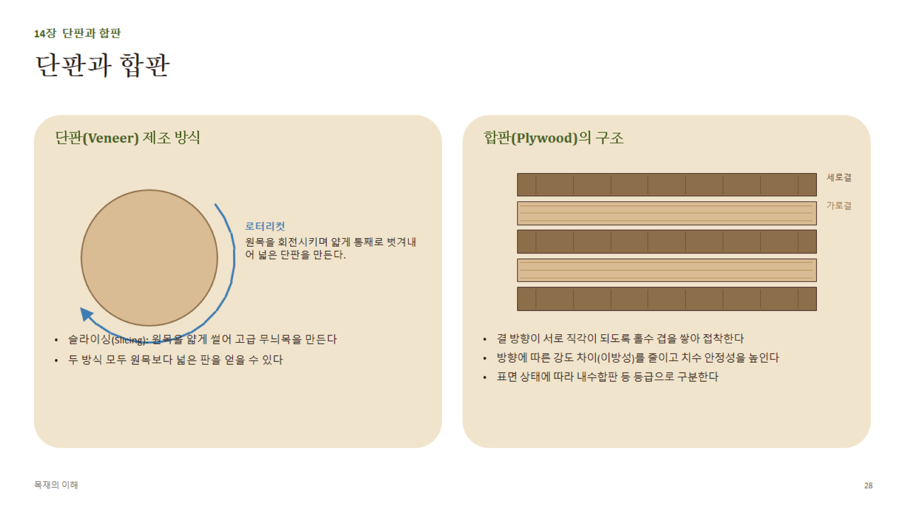

# 14장 · 단판과 합판 (상세)

## 1. 단판(Veneer) 제조 방식

| 방식 | 원리 | 특징 | 용도 |
|---|---|---|---|
| **로터리컷(Rotary cut)** | 원목을 선반처럼 회전시키며 연속으로 얇게 벗겨냄 | 넓은 판을 효율적으로 생산, 무늬가 소용돌이형(생장륜을 따라감) | 합판용 단판 대량생산 |
| **슬라이싱(Slicing/Flat slicing)** | 원목(또는 반원목)을 얇게 평행하게 썰어냄 | 정목/판목 켜는 방향에 따라 다양한 고급 무늬 생산 | 고급 무늬목(화장합판, 가구 표면재) |
| **하프라운드 슬라이싱** | 반원목을 회전축에서 살짝 벗어나 슬라이싱 | 로터리와 슬라이싱의 중간 무늬 | 장식용 무늬목 |

- 단판 두께: 일반적으로 **0.5~3mm** 범위(합판용은 얇고, 무늬목은 상대적으로 두꺼운 편)

## 2. 합판(Plywood)의 구조 원리

- **홀수 겹 적층 원칙**: 3, 5, 7... 겹으로 쌓아 표면 두 겹의 결 방향이 서로 같아지도록(대칭 구조) 함 — 짝수 겹이면 뒤틀림 유발
- **결 방향 직교배치(cross-lamination)**: 인접한 겹마다 섬유 방향을 90도로 교차 → 목재 고유의 **이방성(방향별 강도차)**을 상쇄해 판재 전체의 강도·치수안정성을 평면상에서 균일하게 만듦
- **구성**: 표판(face)-심판(core)-이판(crossband)-이판-배판(back) 등으로 구성, 두꺼운 합판일수록 겹 수 증가

## 3. 합판의 장점 (원목 판재 대비)

1. 방향에 따른 강도차(이방성)가 작음
2. 폭이 넓은 판을 이음매 없이 생산 가능
3. 함수율 변화에 따른 치수변화가 원목보다 훨씬 작음(직교배치 효과)
4. 옹이 등 결함을 여러 겹에 분산시켜 파손 위험 감소

## 4. 합판 등급과 표시 (일반 개념)

- **표면 등급**: 옹이·패치·색상 균일도에 따라 최고급~보통급으로 구분(등급기호는 지역·표준마다 다름, 예: 북미 A-B-C-D 등급, 국내 KS F 3101 등)
- **접착제(내수성) 등급**: 실내용(요소수지, UF 접착) vs 내수/구조용(페놀수지, PF 접착) — 외부 노출 여부에 따라 반드시 구분 사용
- **용도 표기**: 구조용 합판은 별도로 허용 하중·스팬 표가 규정되어 있어 건축 도면에 지정된 사양대로 사용해야 함

## 5. 실무 포인트

- 합판을 절단할 때도 **표면 결 방향**(대개 긴 변과 나란함)을 파악해두면 절단면 마감·강도 배치에 유리
- 습기가 많은 환경(욕실, 외부)에는 반드시 **내수합판/구조용 합판**을 사용 — 실내용 합판은 박리(delamination) 위험
