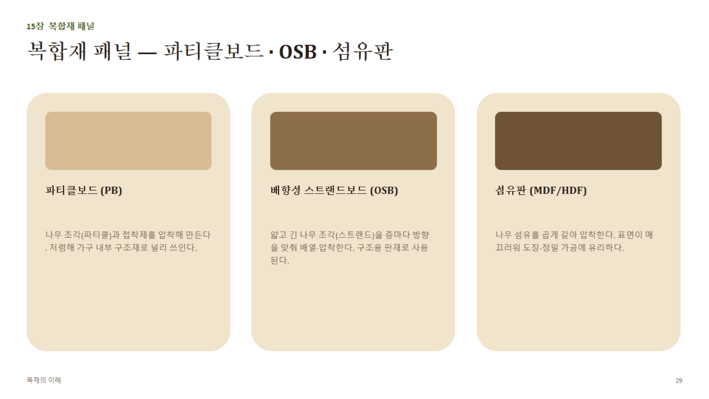

# 15장 · 복합재 패널 (상세)

## 1. 세 가지 패널의 원재료·제조 비교

| 구분 | 파티클보드(PB) | 배향성 스트랜드보드(OSB) | 섬유판(MDF/HDF) |
|---|---|---|---|
| 원재료 형태 | 나무 조각(파티클, 톱밥급~칩급) | 얇고 긴 나무 조각(스트랜드, 수 cm 길이) | 나무섬유(펄프화 수준까지 분쇄) |
| 배열 방식 | 무작위(랜덤) | 층마다 방향을 맞춰 배향(surface layer 직교) | 무작위(균질) |
| 대표 밀도(대략) | 0.6~0.7 g/cm³ | 0.6~0.7 g/cm³ | MDF 0.65~0.8 / HDF 0.8 이상 |
| 표면 특성 | 다소 거침, 도장 전 밀봉 필요 | 거침(구조용이라 마감 최소화) | 매우 매끄러움 — 도장·인쇄·랩핑에 최적 |
| 강도(휨) | 상대적으로 낮음 | 방향성 있는 구조용 강도 확보 | PB보다 우수, 균질하지만 OSB만큼의 구조강도는 아님 |
| 주 용도 | 가구 내부재, 바닥 하지재 | 지붕/벽/바닥 구조용 판재(경량목구조 핵심 자재) | 도장 가구, 몰딩, 정밀 CNC 가공재 |

## 2. 파티클보드(PB) 상세

- 나무 조각 + 요소수지(UF) 등 접착제를 혼합해 열압 성형
- 밀도가 균일하지 않을 수 있음(표층-중심층 밀도차, density profile) — 나사 고정력이 원목보다 약해 **전용 가구용 나사·연결철물(캠록, 미니픽스 등)**을 사용하는 것이 일반적
- 습기에 약함(팽창 심함) → 주방·욕실 가구는 내수 등급(V313 등) 제품 사용 필요

## 3. OSB(Oriented Strand Board) 상세

- 스트랜드를 표층은 패널의 장변 방향, 중심층은 직교 방향으로 배열해 압착 — **합판과 유사한 직교적층 원리**를 스트랜드 단위로 구현
- 구조용 판재 표준(북미 APA 등급 등)에 따라 지붕덮개(roof sheathing), 벽체덮개(wall sheathing), 바닥덮개(subfloor)용으로 등급화
- 합판 대비 저렴하고 큰 사이즈 생산이 용이해 경량목구조에서 널리 대체 사용됨

## 4. 섬유판(MDF/HDF) 상세

- **MDF(Medium Density Fiberboard)**와 **HDF(High Density Fiberboard)**는 밀도 차이로 구분(고밀도일수록 강도·내마모성 증가, 가공성은 다소 저하)
- 도관·나이테 같은 조직이 없어 **절단면이 균일** → CNC 라우팅, 곡선 절단, 도장 마감에 매우 유리
- 습기에 약함 → 습식 공간용은 방습 MDF(녹색 계열 착색) 사용
- 못·나사 보유력은 원목보다 약하지만 PB보다는 나은 편(밀도가 높고 균질하기 때문)

## 5. 선택 기준 요약

- **구조적 강도**가 필요한 부위(바닥, 벽체) → OSB 또는 구조용 합판
- **도장·정밀 가공** 표면이 필요한 가구 부재 → MDF
- **저비용 내부 구조재**(선반 속심, 비노출부) → PB
- **습기 노출 부위** → 반드시 내수 등급 확인(PB·MDF 모두 일반 등급은 습기에 취약)
