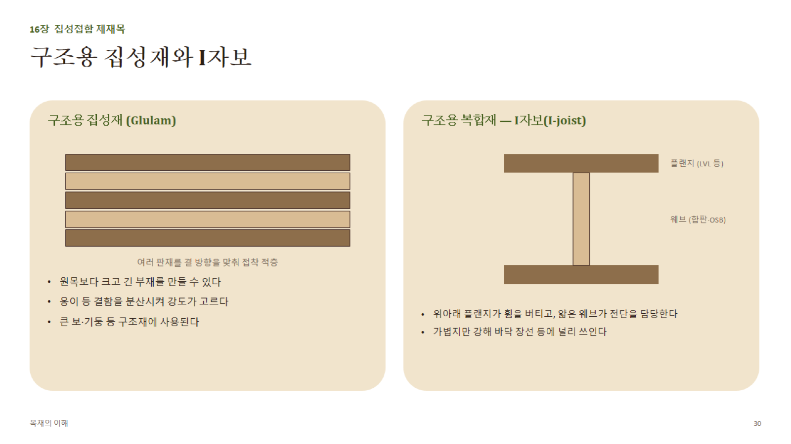

# 16장 · 집성접합 제재목 (상세)

## 1. 구조용 집성재 (Glulam, Glued Laminated Timber)

- **제조 원리**: 얇은 판재(라미나, laminate, 보통 두께 30~45mm)를 **결 방향을 나란히** 맞춰 접착제(주로 멜라민·레조르시놀계, 내수·내구성 우수)로 적층 압착
- **핀거조인트**: 라미나의 길이가 부족하면 핑거조인트(10장 참고)로 이어 붙여 원하는 길이를 확보
- **장점**
  1. 원목 최대 치수의 한계를 넘어서는 **큰 단면·긴 길이**의 부재 제작 가능
  2. 옹이 등 결함이 있는 라미나를 강도가 덜 중요한 위치(중립축 부근)에 배치해 **결함을 분산·재배치** 가능 → 등급별 라미나 배치(외곽 고강도, 중심 저강도)로 효율적인 단면 설계
  3. 곡선 형태(아치 등)도 제작 가능(휨가공 원리와 연결)
- **등급**: 사용하는 라미나의 등급과 배치 방식(대칭/비대칭)에 따라 Glulam 자체의 허용응력이 구조설계기준에 규정됨
- **용도**: 대형 지붕보, 아치, 기둥 등 중목구조·대형목구조의 핵심 부재

## 2. 구조용 복합재 — I자보(I-joist)

- **단면 구성**
  - **플랜지(Flange)**: 위·아래 수평 부재. 휨 모멘트에 의한 **인장·압축력을 주로 부담**. LVL(단판적층재) 또는 등급재 각재 사용
  - **웨브(Web)**: 중앙 수직 부재(얇은 합판 또는 OSB). **전단력을 부담**
- **역학적 이유**: 보의 휨에서 응력은 단면 중심(중립축)에서 0이고 상하 표면에서 최대가 됨 → 상하 표면에만 강한 재료(플랜지)를 배치하고, 응력이 작은 중앙부는 가벼운 재료(웨브)로 채우는 것이 **재료 효율이 가장 높은 단면 형태**(강철 H형강과 같은 원리)
- **장점**: 원목 장선(solid joist) 대비 가볍고, 곧고, 뒤틀림이 없으며(공학목재라 함수율 변화에 안정적) 더 긴 스팬 시공 가능
- **시공 시 유의점**: 웨브에 배관·전선용 구멍을 뚫을 때는 **제조사가 정한 허용 위치·크기**를 반드시 지켜야 함(임의로 뚫으면 전단 성능 급격히 저하)

## 3. 공학목재(Engineered Wood Product, EWP) 전체 맥락

| 제품 | 원리 | 주 용도 |
|---|---|---|
| Glulam | 각재 라미나 적층(결 방향 나란히) | 대형 보·기둥·아치 |
| LVL(단판적층재) | 단판(베니어)을 결 방향 나란히 적층 | I자보 플랜지, 헤더, 보 |
| I-joist | 플랜지(LVL 등)+웨브(합판/OSB) | 바닥·지붕 장선 |
| PSL/LSL(평행/배향 스트랜드 집성재) | 긴 스트랜드를 결 방향 맞춰 압착 | 기둥, 헤더, 보 |

- **공통된 장점**: 원목의 한계(옹이, 결 기울기, 크기 제한, 불균일한 수축)를 가공 공정으로 극복해 **예측 가능하고 균일한 구조 성능**을 확보 — 현대 경량목구조·중목구조 설계의 신뢰성을 뒷받침하는 핵심 자재군
